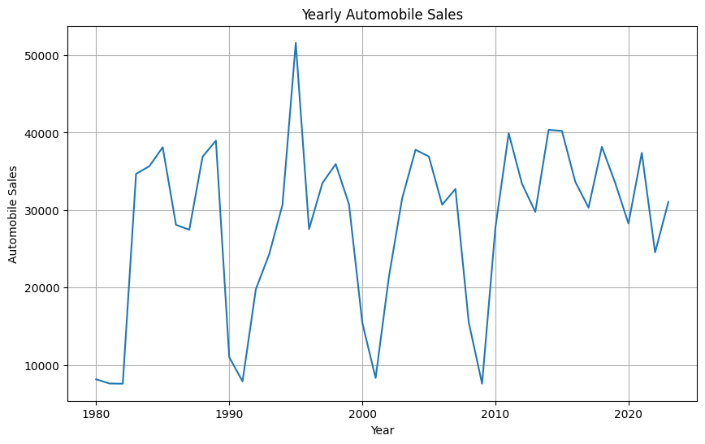
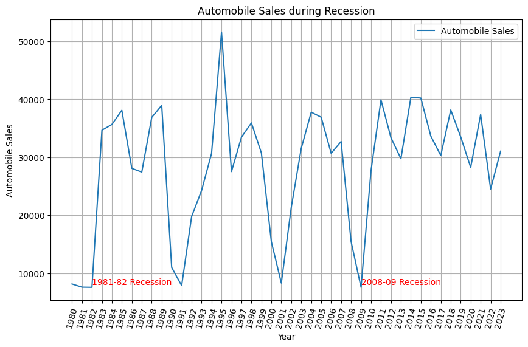
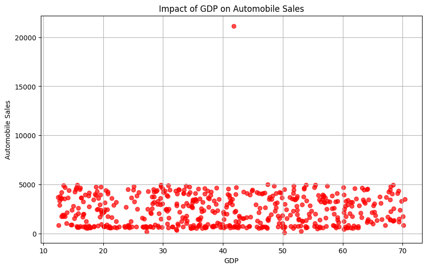
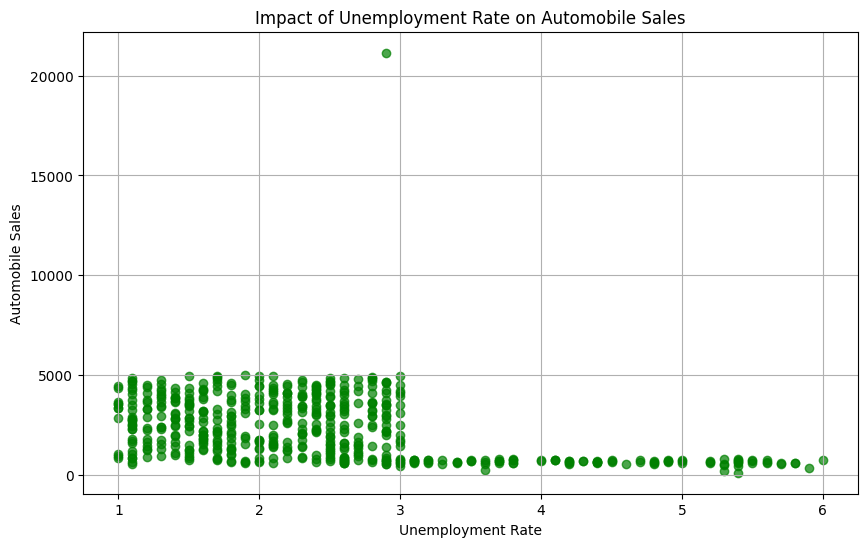
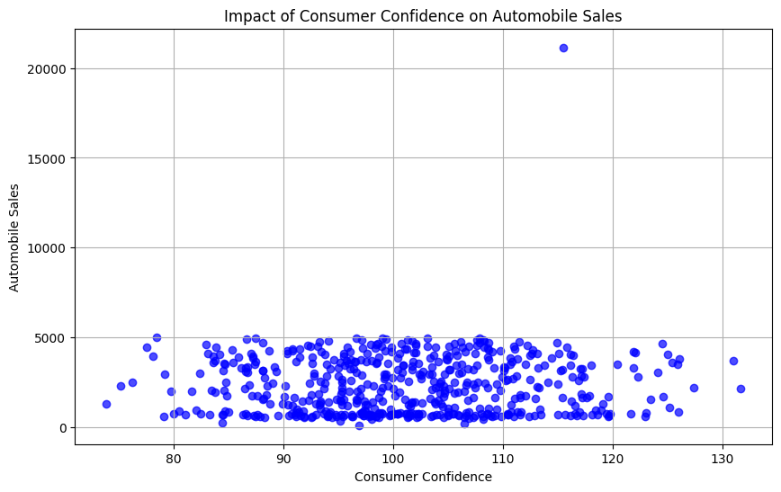
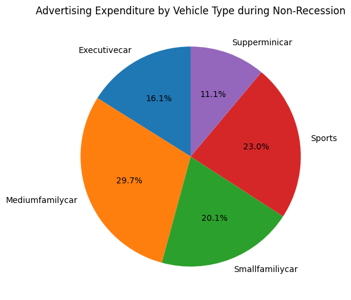
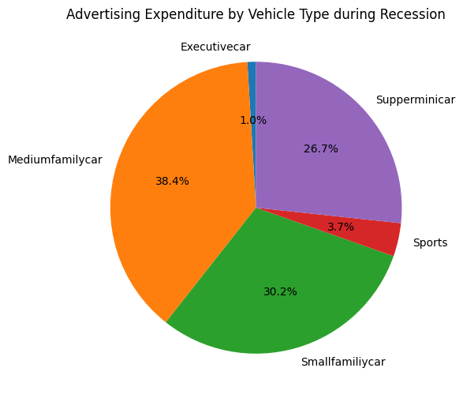
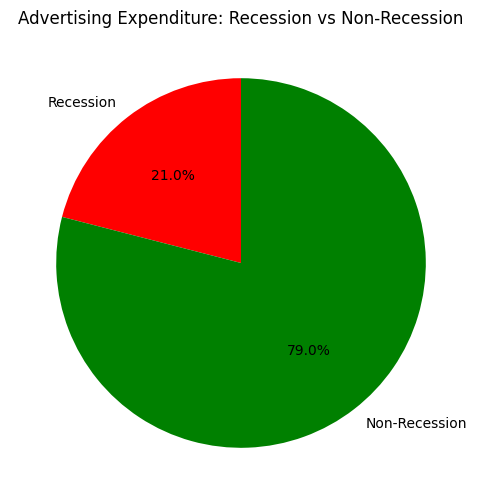
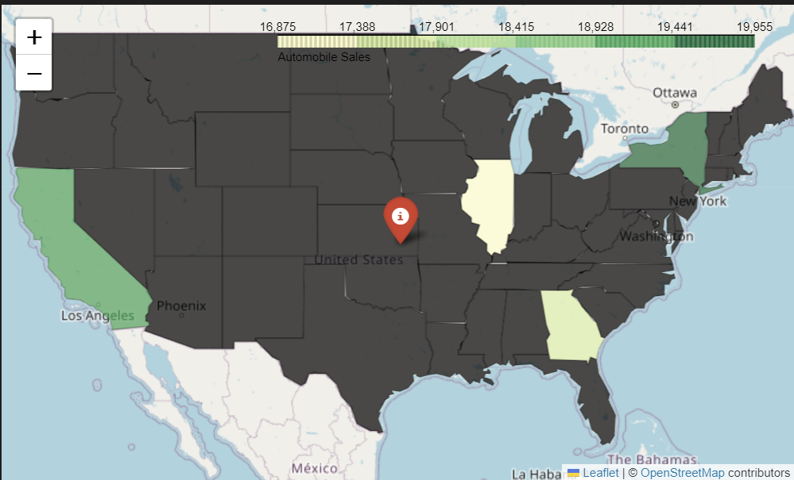
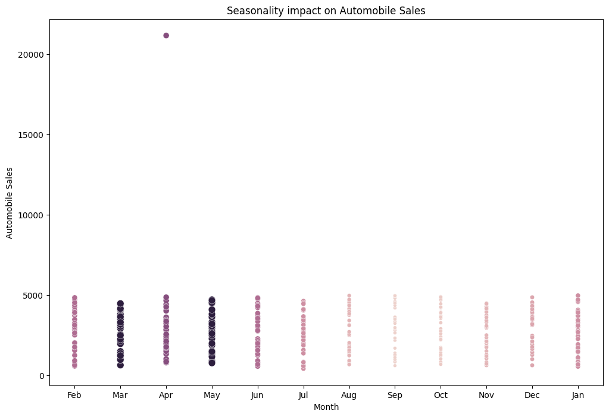

## Résumé du Projet

### Objectif
Analyser les données historiques des ventes automobiles pour identifier les tendances, l'impact des récessions, et les facteurs influençant les ventes.

---

### Étapes Réalisées

1. **Chargement des Données**
    - Les données ont été importées depuis une URL sous forme de DataFrame `df` à l'aide de `pandas`.

2. **Exploration des Données**
    - Affichage des premières lignes (`df.head()`), des types de données (`df.dtypes`), et des statistiques descriptives (`df.describe()`).
    - Identification des colonnes disponibles : `Date`, `Year`, `Month`, `Recession`, `Consumer_Confidence`, etc.

3. **Analyse des Tendances Générales**
    - Agrégation des ventes annuelles (`sales_by_year`) et création de graphiques linéaires pour visualiser les tendances des ventes automobiles au fil des années.
    - Mise en évidence des baisses significatives pendant les périodes de récession (1981-82, 2008-09, 2020).

    

4. **Analyse des Récessions**
    - Comparaison des ventes moyennes pendant les périodes de récession et de non-récession à l'aide de graphiques en barres (`sns.barplot`).
    - Analyse des types de véhicules les plus résilients pendant les récessions (ex. : `Smallfamilycar` et `Supperminicar`).

    

5. **Analyse des Facteurs Économiques**
    - Étude de l'impact de la confiance des consommateurs, du taux de chômage, et du PIB sur les ventes automobiles.
    - Visualisation des relations entre ces facteurs et les ventes à l'aide de graphiques de dispersion (`plt.scatter`).

    
    
    

6. **Analyse des Dépenses Publicitaires**
    - Comparaison des dépenses publicitaires pendant les périodes de récession et de non-récession.
    - Création de graphiques en secteurs pour visualiser la répartition des dépenses par type de véhicule.

    
    
    

7. **Analyse Géographique**
    - Utilisation de `folium` pour créer des cartes choroplèthes montrant les ventes par état et par ville pendant les récessions.
    - Identification des régions avec les ventes les plus élevées.

    

8. **Analyse de la Saisonnalité**
    - Étude de l'impact de la saisonnalité sur les ventes à l'aide de graphiques en bulles (`sns.scatterplot`).

    

9. **Insights Clés**
    - Les récessions entraînent des baisses significatives des ventes, mais certains types de véhicules restent stables.
    - Les dépenses publicitaires sont réduites pendant les récessions, mais elles jouent un rôle clé dans la reprise des ventes.
    - Les facteurs économiques comme le taux de chômage et la confiance des consommateurs influencent fortement les ventes.

---

### Conclusion
Ce projet a permis d'identifier les tendances des ventes automobiles, les impacts des récessions, et les facteurs économiques clés. Les insights obtenus peuvent guider les stratégies des constructeurs automobiles pour mieux s'adapter aux cycles économiques et aux préférences des consommateurs.