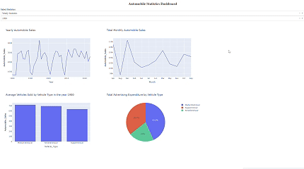

   # Tableau de Bord des Statistiques Automobiles

   ## Aperçu du Projet
   Ce projet consiste à créer un tableau de bord interactif à l'aide de Dash et Plotly pour visualiser les données de ventes automobiles. Le tableau de bord fournit des informations sur les statistiques annuelles et celles des périodes de récession, permettant aux utilisateurs d'explorer les tendances et les modèles des ventes automobiles.

   ## Fonctionnalités
   1. **Menus déroulants** :
      - Sélection entre "Statistiques annuelles" et "Statistiques des périodes de récession".
      - Choix d'une année spécifique pour les statistiques annuelles.

   2. **Visualisations interactives** :
      - Graphiques linéaires, graphiques à barres et graphiques circulaires pour représenter les tendances des données.
      - Mises à jour dynamiques basées sur les sélections des utilisateurs.

   3. **Statistiques des périodes de récession** :
      - Fluctuation moyenne des ventes automobiles pendant les périodes de récession.
      - Moyenne des véhicules vendus par type de véhicule pendant les récessions.
      - Part des dépenses publicitaires totales par type de véhicule.
      - Effet du taux de chômage sur le type de véhicule et les ventes.

   4. **Statistiques annuelles** :
      - Tendances des ventes automobiles annuelles.
      - Total des ventes automobiles mensuelles.
      - Moyenne des véhicules vendus par type de véhicule pour une année sélectionnée.
      - Dépenses publicitaires totales par type de véhicule.

   ## Technologies Utilisées
   - **Dash** : Pour construire l'application web.
   - **Plotly** : Pour créer des visualisations interactives.
   - **Pandas** : Pour la manipulation et l'analyse des données.

   ## Source des Données
   Les données utilisées dans ce projet proviennent du réseau de compétences pour développeurs d'IBM et contiennent des données historiques sur les ventes automobiles.

   ## Comment Exécuter le Projet
   1. Installez les bibliothèques Python nécessaires :
      ```bash
      pip install dash pandas plotly
      ```
   2. Enregistrez le code dans un fichier nommé `app.py`.
   3. Exécutez l'application :
      ```bash
      python app.py
      ```
   4. Ouvrez le tableau de bord dans votre navigateur à l'adresse `http://127.0.0.1:8050`.

   ## Tableau de Bord Final
   <p align="center">
  
</p>


   ## Améliorations Futures
   - Ajouter plus de filtres pour une exploration plus approfondie des données.
   - Inclure des visualisations supplémentaires pour d'autres métriques.
   - Optimiser le code pour de meilleures performances avec des ensembles de données plus volumineux.

   ## Remerciements
   - IBM Developer Skills Network pour la fourniture du jeu de données.
   - Dash et Plotly pour leurs puissants outils de visualisation.