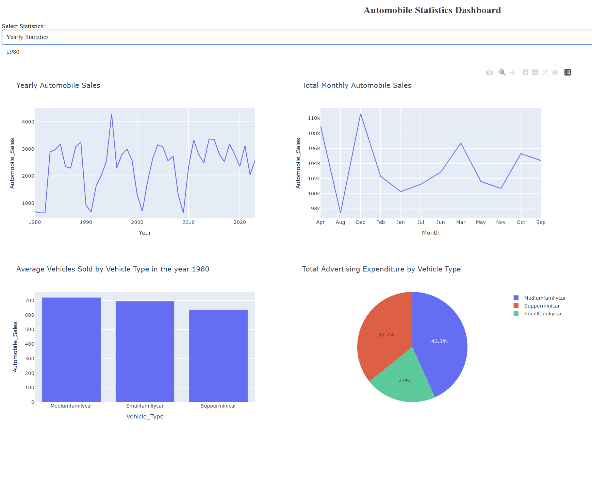

# 📊 Visualisation de Données avec Python – Projet Final

Ce projet est réalisé dans le cadre du cours **"Visualisation de données avec Python"** proposé par IBM sur Coursera.

## 🗂️ Contenu du projet

Le projet est structuré en plusieurs parties :

- **Partie 1** : Création de visualisations statiques avec **Matplotlib**, **Seaborn** et **Folium**.
- **Partie 2** : Conception d’un **dashboard interactif** avec **Plotly Dash** permettant d'explorer les statistiques de vente d'automobiles.

## 🚀 Accès au Dashboard



Le tableau de bord interactif se trouve dans le dossier `Partie2`.  
Il peut être lancé localement via :


```bash
python app.py

