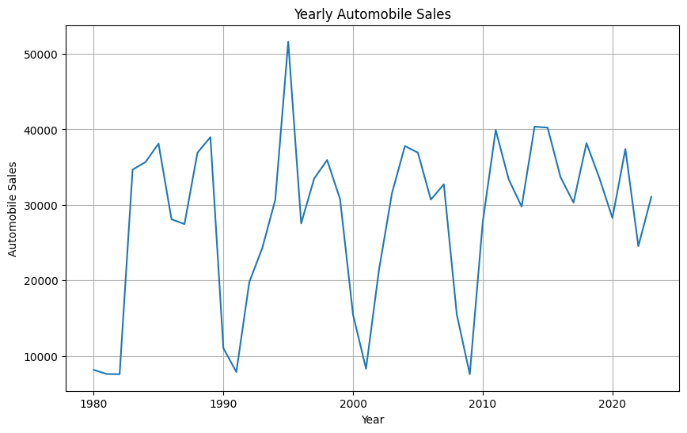

# Automobile Statistics Dashboard

## Description du Projet

Ce projet consiste à développer un tableau de bord interactif pour analyser les statistiques automobiles historiques. Le tableau de bord est construit avec **Dash** et **Plotly**, et il permet aux utilisateurs d'explorer les données selon deux perspectives principales :
1. **Statistiques annuelles** : Analyse des ventes automobiles pour une année spécifique.
2. **Statistiques des périodes de récession** : Analyse des ventes et des dépenses publicitaires pendant les périodes de récession.

---

## Fonctionnalités

### 1. **Sélection des Statistiques**
- Un menu déroulant permet de choisir entre deux types de rapports :
  - **Statistiques annuelles**
  - **Statistiques des périodes de récession**

### 2. **Statistiques annuelles**
Lorsqu'une année est sélectionnée, les graphiques suivants sont générés :
- **Graphique 1** : Ventes automobiles moyennes par année (graphique linéaire).


- **Graphique 2** : Ventes automobiles totales par mois (graphique linéaire).
- **Graphique 3** : Moyenne des véhicules vendus par type de véhicule pour l'année sélectionnée (diagramme en barres).
- **Graphique 4** : Dépenses publicitaires totales par type de véhicule pour l'année sélectionnée (diagramme circulaire).

**Emplacement pour les illustrations :**
- Graphique 1 : _[Ajoutez ici une capture d'écran du graphique linéaire des ventes annuelles.]_
- Graphique 2 : _[Ajoutez ici une capture d'écran du graphique linéaire des ventes mensuelles.]_
- Graphique 3 : _[Ajoutez ici une capture d'écran du diagramme en barres des ventes par type de véhicule.]_
- Graphique 4 : _[Ajoutez ici une capture d'écran du diagramme circulaire des dépenses publicitaires.]_

### 3. **Statistiques des périodes de récession**
Lorsqu'une période de récession est sélectionnée, les graphiques suivants sont générés :
- **Graphique 1** : Fluctuation moyenne des ventes automobiles pendant les périodes de récession (graphique linéaire).
- **Graphique 2** : Moyenne des véhicules vendus par type de véhicule pendant les périodes de récession (diagramme en barres).
- **Graphique 3** : Part des dépenses publicitaires totales par type de véhicule pendant les périodes de récession (diagramme circulaire).
- **Graphique 4** : Effet du taux de chômage sur les ventes et les types de véhicules (diagramme en barres).

**Emplacement pour les illustrations :**
- Graphique 1 : _[Ajoutez ici une capture d'écran du graphique linéaire des fluctuations pendant les récessions.]_
- Graphique 2 : _[Ajoutez ici une capture d'écran du diagramme en barres des ventes par type de véhicule pendant les récessions.]_
- Graphique 3 : _[Ajoutez ici une capture d'écran du diagramme circulaire des dépenses publicitaires pendant les récessions.]_
- Graphique 4 : _[Ajoutez ici une capture d'écran du diagramme en barres de l'effet du chômage sur les ventes.]_

---

## Structure du Projet

### **Partie 1 : Création des Visualisations**
Les visualisations statiques ont été créées à l'aide de **Matplotlib**, **Seaborn**, et **Folium**. Ces graphiques incluent :
- Graphiques linéaires
- Diagrammes en barres
- Diagrammes circulaires
- Cartes interactives

Les fichiers générés sont disponibles dans le dossier `Part1/`.

### **Partie 2 : Création du Tableau de Bord**
Le tableau de bord interactif a été développé en utilisant **Dash** et **Plotly**. Le fichier principal est :
- `Part2/app.py` : Contient le code pour le tableau de bord.

---

## Instructions pour Exécuter le Projet

1. **Installer les dépendances**
   Assurez-vous d'avoir Python installé, puis exécutez la commande suivante pour installer les bibliothèques nécessaires :
   ```bash
   pip install dash pandas plotly

2. **Exécuter l'application Naviguez vers le dossier**
   Naviguez vers le dossier Part2/ et exécutez le fichier app.py :
   ```bash
   python app.py

3. **Accéder au tableau de bord**
   Ouvrez un navigateur et accédez à l'URL suivante :
   ```bash
   http://127.0.0.1:8050/
